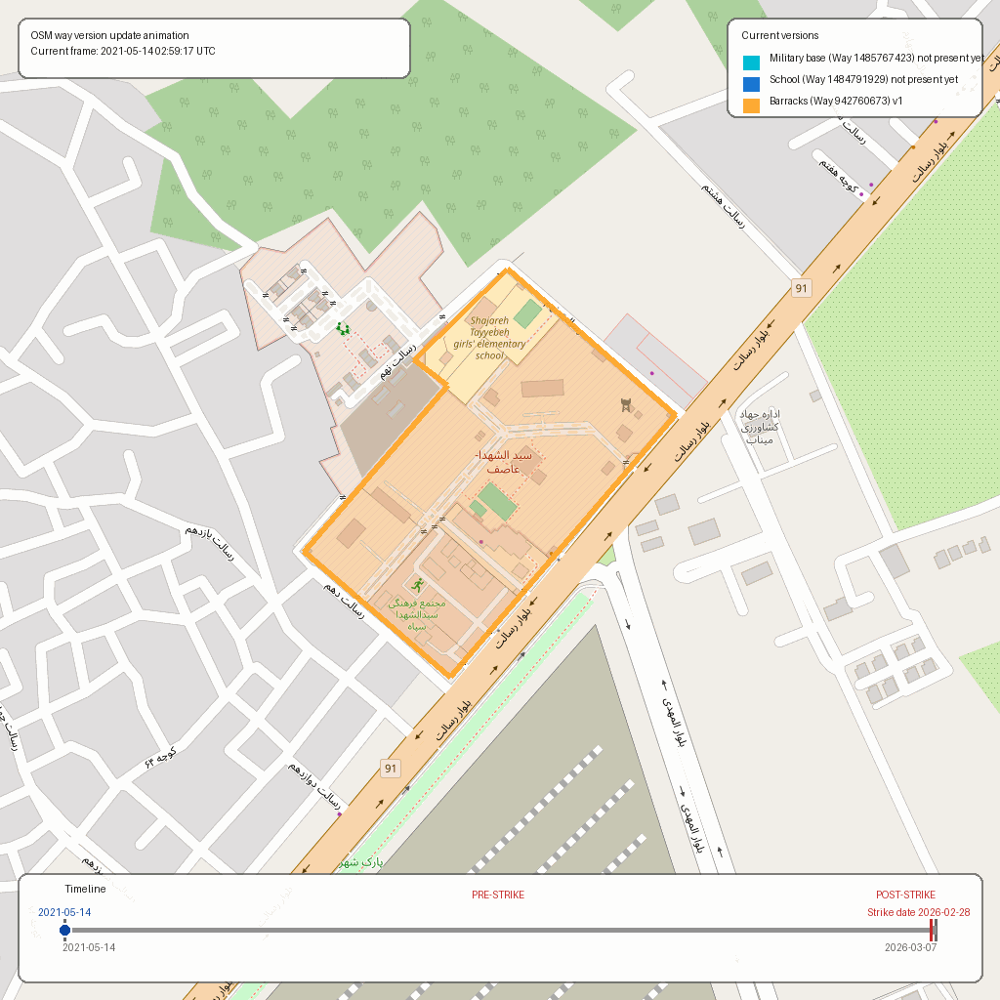
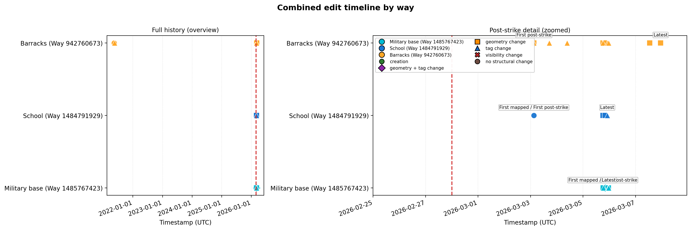
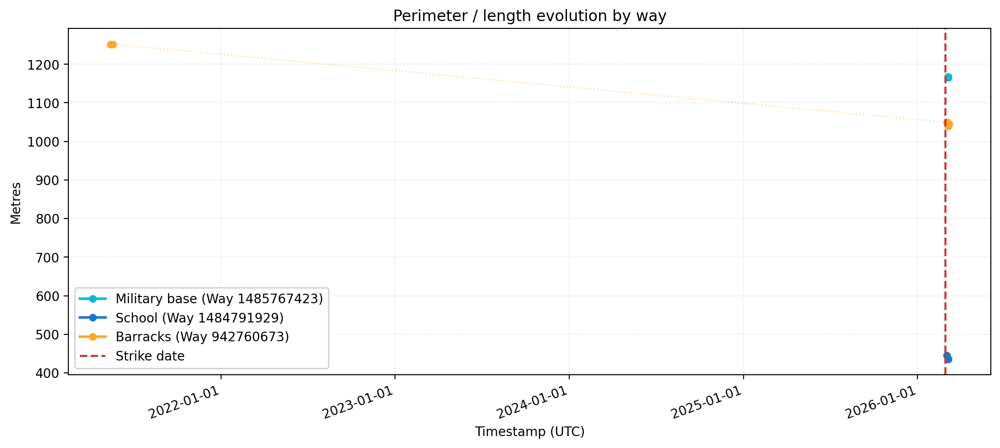
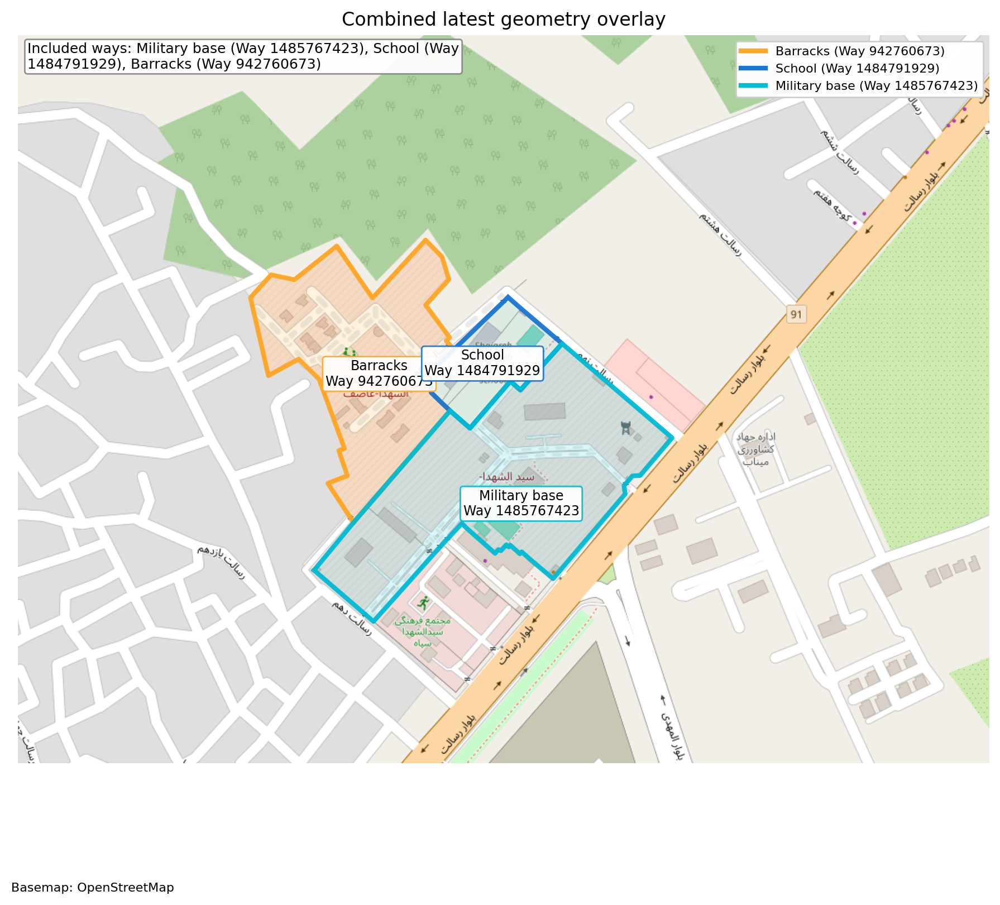
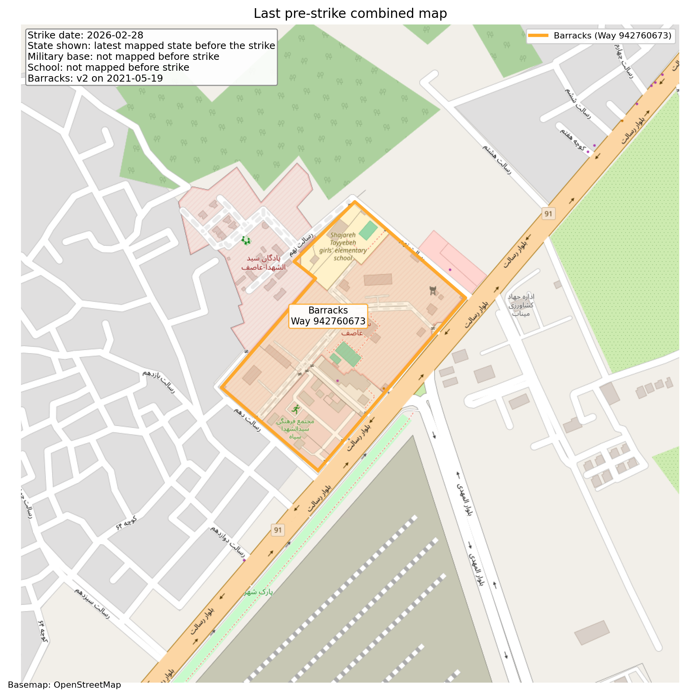
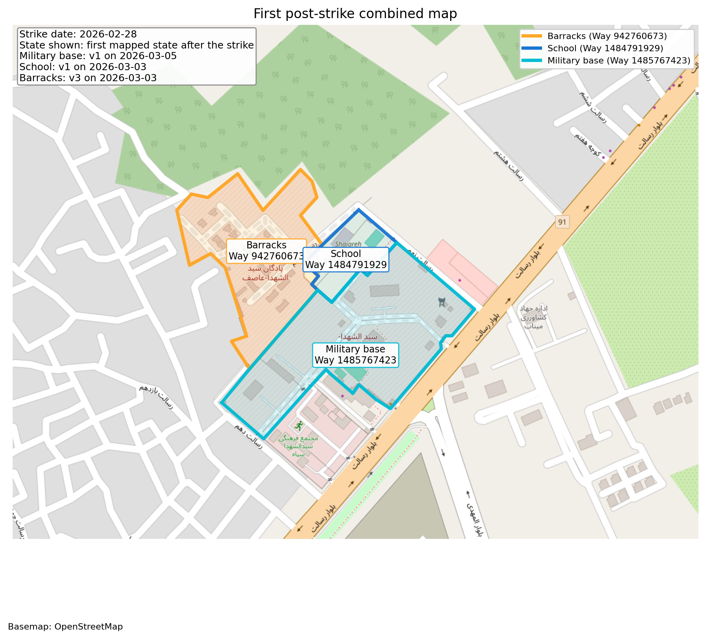
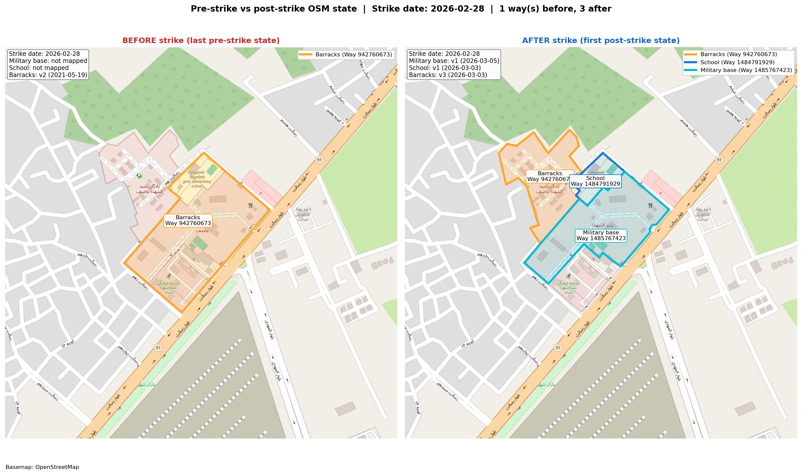
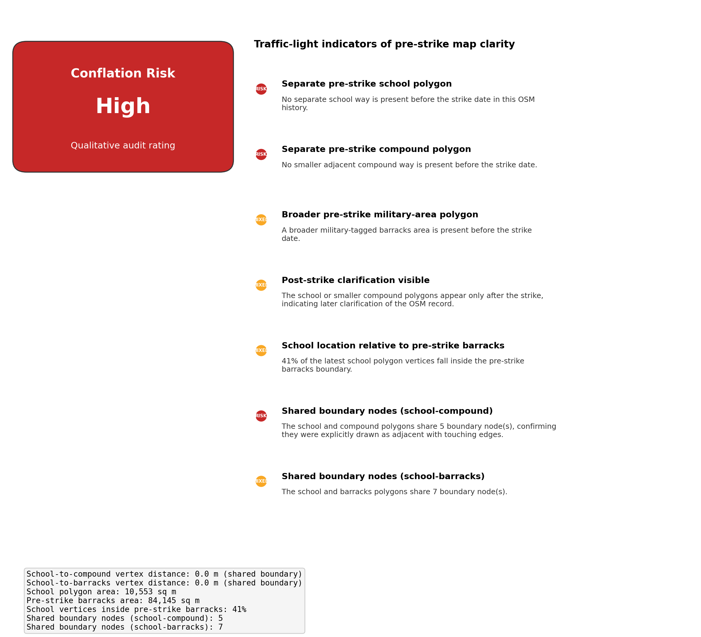

# OpenStreetMap History Audit: Shajareh Tayyebeh Girls' School and Adjacent Military Mapping in Minab, Iran

## Short Context

This repository is a post-incident OpenStreetMap history review focused on the mapping state around the strike on the Shajareh Tayyebeh girls' school in Minab on 28 February 2026. The outputs are intended for forensic, journalistic, and technical review, not operational analysis.

## Methodology

OpenStreetMap (OSM) is a collaborative map database that stores geographic features as editable objects with version history. A **way** in OSM is an ordered list of nodes: it can represent a line, such as a road or wall, or a closed polygon, such as a school or compound perimeter.

This repository queries the OSM API for the full history of the selected ways and their nodes, reconstructs each way's geometry at each known edit timestamp, and then compares four states for each object: first mapped, last pre-strike, first post-strike, and latest. The outputs focus on whether the school, the smaller military base, and the broader barracks area were mapped clearly and separately before **28 February 2026**.

## Ways Analysed

| Way ID | Label | Role | First version | Latest version |
| --- | --- | --- | --- | --- |
| 942760673 | Sayyid al-Shuhada-Asif barracks area | barracks_area | v1 (2021-05-14 02:59:17 UTC) | v13 (2026-03-07 22:56:51 UTC) |
| 1484791929 | Shajareh Tayyebeh girls' school | school | v1 (2026-03-03 03:03:10 UTC) | v4 (2026-03-05 22:09:35 UTC) |
| 1485767423 | Suspected IRGC compound | compound | v1 (2026-03-05 18:06:31 UTC) | v10 (2026-03-05 23:23:54 UTC) |

## Strike Date and Why It Matters

The analytical divider used by this run is **2026-02-28 00:00:00 UTC**. The script labels the first version, last pre-strike version, first post-strike version, and latest version for each analysed way, then uses those states consistently in the tables and map exports.

## Key Findings

- The school polygon first appears on 2026-03-03 03:03:10 UTC, after the strike divider of 2026-02-28 00:00:00 UTC.
- The smaller suspected compound polygon also appears only after the strike, first at 2026-03-05 18:06:31 UTC.
- The broader barracks-area way predates the strike and remains the clearest pre-strike military-tagged perimeter in this OSM record.
- The school and compound polygons share 5 boundary node(s), meaning they were explicitly drawn as adjacent with touching edges in the post-strike OSM record.
- Overall OSM conflation-risk rating from these indicators: High.
- Post-strike edits materially expand the school and compound record, which suggests the OSM map became more explicit after 28 February 2026.

## Timeline Visualisations



This animation replays the mapped geometry changes through time. The bottom timeline shows that the broader barracks way already exists in the pre-strike period, while the school and smaller military-base polygons only enter the OSM record after the strike divider.



The combined timeline compresses the edit history into discrete events by object. It shows that most school and smaller military-base edits cluster after 28 February 2026, whereas the barracks object has both pre-strike history and a second burst of post-strike refinement.



This chart tracks how each way's perimeter or line length changes over time. The barracks perimeter changes across pre-strike and post-strike states, while the school and smaller military-base perimeters only appear once those ways are created after the strike.

## Geometry Overlays



This overlay shows the latest OSM state, where the School, Military base, and Barracks are mapped as separate named polygons rather than one undifferentiated area. In the latest mapped state, the school and military-base polygons directly touch or abut in the OSM geometry.



This is the key pre-strike reference image. In the current history, the school and the smaller military base are not yet present here as separate ways, while the broader barracks boundary remains the main military-tagged pre-strike polygon. Barracks last pre-strike state: 2021-05-19 02:17:22 UTC; School: not mapped before strike; Military base: not mapped before strike.



This panel shows the first available post-strike state for each way. It makes the map clarification visible by showing when the school and smaller military-base polygons first appear as distinct objects in OSM. Barracks first post-strike state: 2026-03-03 03:03:10 UTC; School first post-strike state: 2026-03-03 03:03:10 UTC; Military base first post-strike state: 2026-03-05 18:06:31 UTC.



This side-by-side comparison is the key visual. The left panel shows the last pre-strike OSM state; the right panel shows the first post-strike state. The difference makes immediately visible how the map record changed after the strike.

## Spatial Analysis

- **Containment**: 41% of the latest school polygon's vertices fall inside the pre-strike barracks boundary. Before the strike, the school's location was part of an undifferentiated military-tagged area in OSM.
- **Shared boundary nodes** (school compound): 5 node(s) shared, confirming these polygons were drawn with touching or coincident edges.
- **Shared boundary nodes** (school barracks): 7 node(s) shared, confirming these polygons were drawn with touching or coincident edges.
- **School area**: 10,553 sq m (latest polygon)
- **Pre-strike barracks area**: 84,145 sq m
- **School-to-compound distance**: 0.0 m (shared boundary)
- **School-to-barracks distance**: 0.0 m (shared boundary)



This figure turns the edit history and spatial analysis into a brief interpretive summary. The current qualitative audit rating is High, driven by the combination of pre-strike mapping gaps and post-strike clarification.

## Pre-strike State Comparison

| Way | Last pre-strike | First post-strike | Latest |
| --- | --- | --- | --- |
| Sayyid al-Shuhada-Asif barracks area | v2 (2021-05-19 02:17:22 UTC) | v3 (2026-03-03 03:03:10 UTC) | v13 (2026-03-07 22:56:51 UTC) |
| Shajareh Tayyebeh girls' school | Not present | v1 (2026-03-03 03:03:10 UTC) | v4 (2026-03-05 22:09:35 UTC) |
| Suspected IRGC compound | Not present | v1 (2026-03-05 18:06:31 UTC) | v10 (2026-03-05 23:23:54 UTC) |

## Why the Edit History May Matter

The current qualitative audit rating for conflation risk is **High**. In this repository, that means the degree to which the pre-strike map record was explicit enough to keep the school, the smaller adjacent compound, and the broader military area clearly distinct. This is an audit heuristic, not a legal or operational conclusion.

## Caveats

- Way history is fetched from the OpenStreetMap API for each configured way ID.
- Geometry is reconstructed from node history by selecting the latest coordinate-bearing node version at or before each way version timestamp where possible.
- Rows that required fallback geometry or had missing node coordinates are flagged in the CSV outputs.
- This repository remains framed as post-incident mapping-history review for audit and explanation, not operational analysis.

## Output Files

- `results/before_after_comparison.png`
- `results/combined_latest_overlay.png`
- `results/combined_timeline.png`
- `results/combined_way_history_analysis.csv`
- `results/conflation_risk.png`
- `results/milestone_state_comparison.csv`
- `results/perimeter_comparison.png`
- `results/results.txt`
- `results/state_maps/first_post_strike_combined.png`
- `results/state_maps/first_post_strike_way_1484791929.png`
- `results/state_maps/first_post_strike_way_1485767423.png`
- `results/state_maps/first_post_strike_way_942760673.png`
- `results/state_maps/first_version_combined.png`
- `results/state_maps/first_version_way_1484791929.png`
- `results/state_maps/first_version_way_1485767423.png`
- `results/state_maps/first_version_way_942760673.png`
- `results/state_maps/last_pre_strike_combined.png`
- `results/state_maps/last_pre_strike_way_1484791929.png`
- `results/state_maps/last_pre_strike_way_1485767423.png`
- `results/state_maps/last_pre_strike_way_942760673.png`
- `results/state_maps/latest_combined.png`
- `results/state_maps/latest_way_1484791929.png`
- `results/state_maps/latest_way_1485767423.png`
- `results/state_maps/latest_way_942760673.png`
- `results/way_1484791929_geometry_overlay.png`
- `results/way_1484791929_history_analysis.csv`
- `results/way_1484791929_timeline.png`
- `results/way_1485767423_geometry_overlay.png`
- `results/way_1485767423_history_analysis.csv`
- `results/way_1485767423_timeline.png`
- `results/way_942760673_geometry_overlay.png`
- `results/way_942760673_history_analysis.csv`
- `results/way_942760673_timeline.png`
- `results/way_history_summary.csv`

## Reproducibility / How to Run

```bash
python main.py --strike-date 2026-02-28
```
